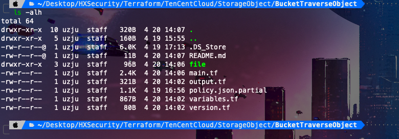
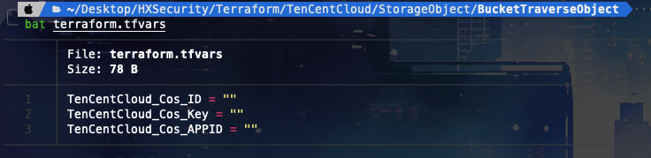
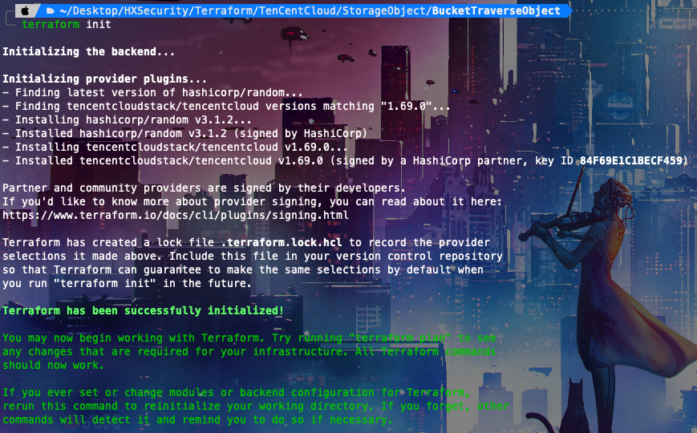
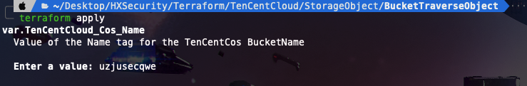
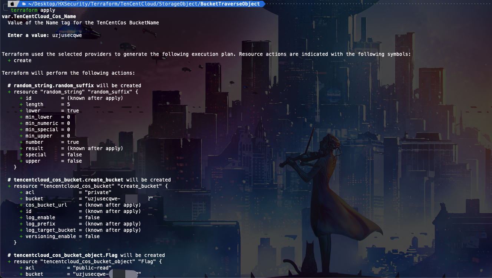
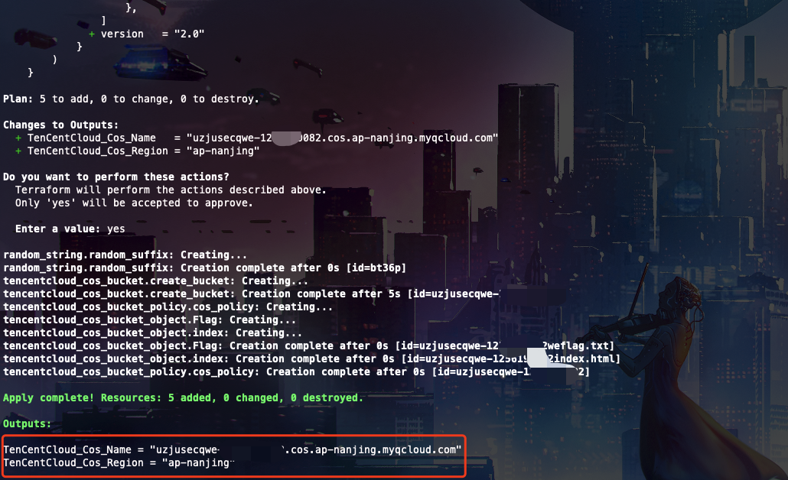
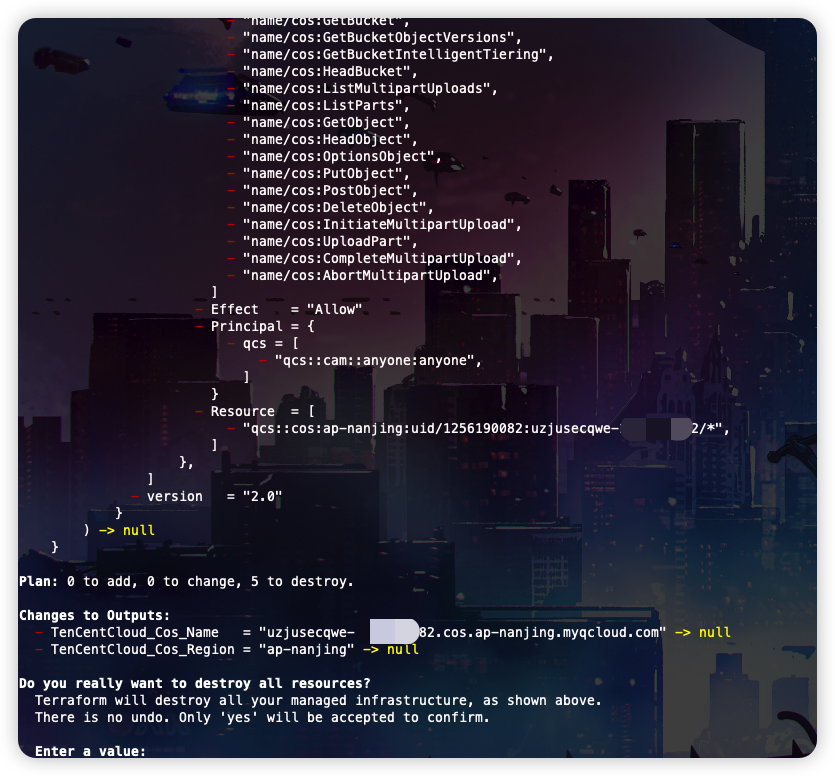
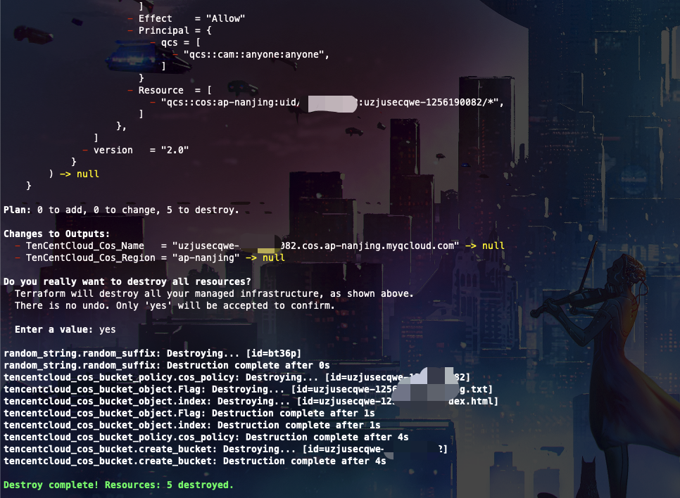

# Description

English | [中文](./README_CN.md)

This is a script that can help you quickly build bucket objects to traverse the scene

After you complete the challenge, you can review the source code to see why this is the case

## Deployment Environment

```bash
cd /TerraformGoat/TenCentCloud/bucket_object_traversal/
```



Edit variables.tf to write your Tencent Cloud security key

```bash
vim terraform.tfvars
```

Tips: There is a string of numbers in the object storage of Tencent Cloud, which comes from the APPID of the account.


You can also manually enter the code after commenting it with #



```bash
terraform init
```



```bash
terraform apply
```



Type the BucketName and type (ps: Bucket name must be lowercase )



Check output, if there is no problem, enter yes.



Now you can see that output shows the address of the storage bucket we created with the region, Now Go get flags

## Challenge to destroy

```bash
terraform destory
```



To verify that there is no problem, type Yes



GooOOOOOOOOOOOd Bye~
