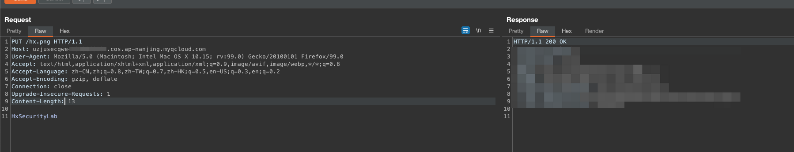

# Description

English | [中文](./README_CN.md)

This is a script that can quickly help you build arbitrary file upload scenarios for storage buckets

## Deployment environment

```bash
cd /TerraformGoat/TenCentCloud/unrestricted_file_upload/
```


```bash
vim terraform.tfvars
```

Write in your Tencent Cloud account AK with KEY and APPID


```bash
terraform init
```


```bash
terraform apply
```


Type the name of the bucket you want to create, then press enter, check if there are any problems, and type yes


 access /hx.png Directly


Now we can overwrite this file by using the PUT method



```http
PUT /hx.png HTTP/1.1
Host: uzjusecqwe-.cos.ap-nanjing.myqcloud.com
User-Agent: Mozilla/5.0 (Macintosh; Intel Mac OS X 10.15; rv:99.0) Gecko/20100101 Firefox/99.0
Accept: text/html,application/xhtml+xml,application/xml;q=0.9,image/avif,image/webp,*/*;q=0.8
Accept-Language: zh-CN,zh;q=0.8,zh-TW;q=0.7,zh-HK;q=0.5,en-US;q=0.3,en;q=0.2
Accept-Encoding: gzip, deflate
Connection: close
Upgrade-Insecure-Requests: 1
Content-Length: 13

HxSecurityLab
```

Then use the GET method to get the image we covered


## Destruction Challenge

```bash
terraform destroy
```


Then press enter, type yes and wait for the destruction
