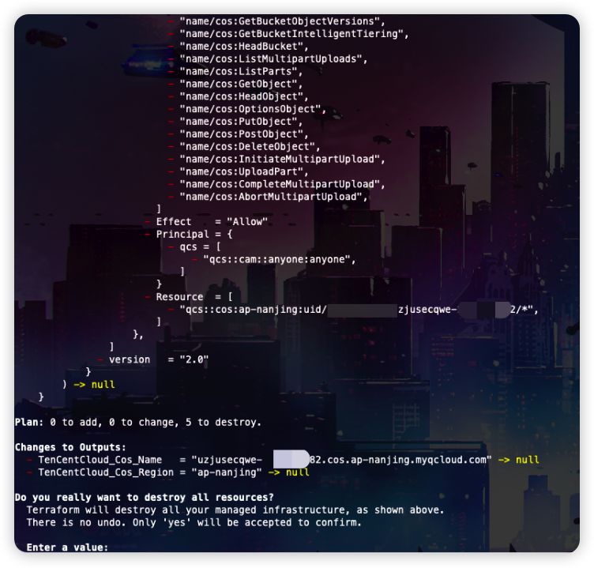

# Description

English | [中文](./README_CN.md)

This is a script that can help you quickly build bucket objects to traverse the scene

After you complete the challenge, you can review the source code to see why this is the case

## Deployment Environment

```bash
cd /TerraformGoat/tencentcloud/cos/bucket_object_traversal/
```

Edit variables.tf to write your Tencent Cloud security key

```bash
vim terraform.tfvars
```


```bash
terraform init
terraform apply
```

Check output, if there is no problem, enter yes.


Now you can see that output shows the address of the storage bucket we created with the region, Now Go get flags

## Challenge to destroy

```bash
terraform destory
```



To verify that there is no problem, type Yes


GooOOOOOOOOOOOd Bye~
