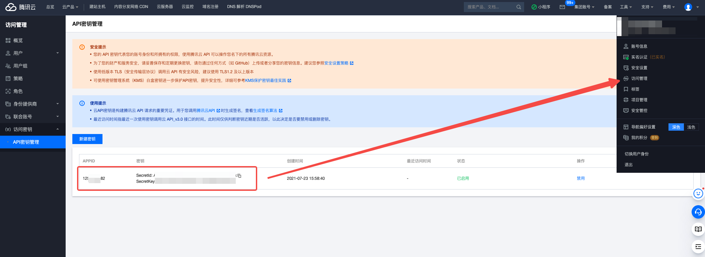

# 描述

[English](./README.md) | 中文

这是一个可以帮你快速构建存储桶对象遍历场景的脚本

在你完成挑战后，你可以查看源代码以了解为什么会出现这种情况

## 部署环境

```bash
cd /TerraformGoat/tencentcloud/cos/bucket_object_traversal/
```

编辑terraform.tfvars输入你的腾讯云AK和KEY

```bash
vim terraform.tfvars
```



```bash
terraform init
terraform apply
```

检查输出，如果没有问题，输入Yes

现在可以看到输出了存储桶的地址，现在可以去获取Flag了

## Challenge to destroy

```bash
terraform destory
```

如果确认没有问题，输入 yes 然后回车即可
