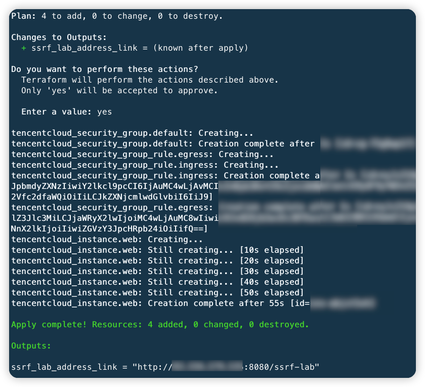
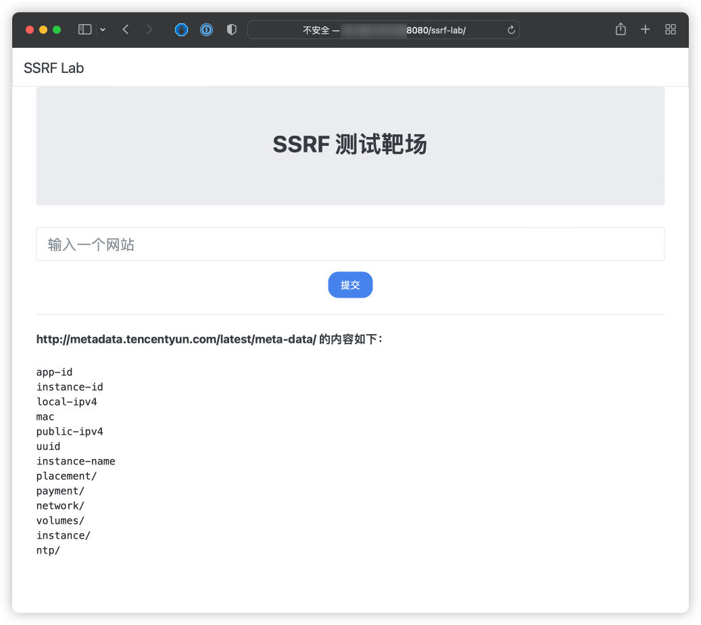
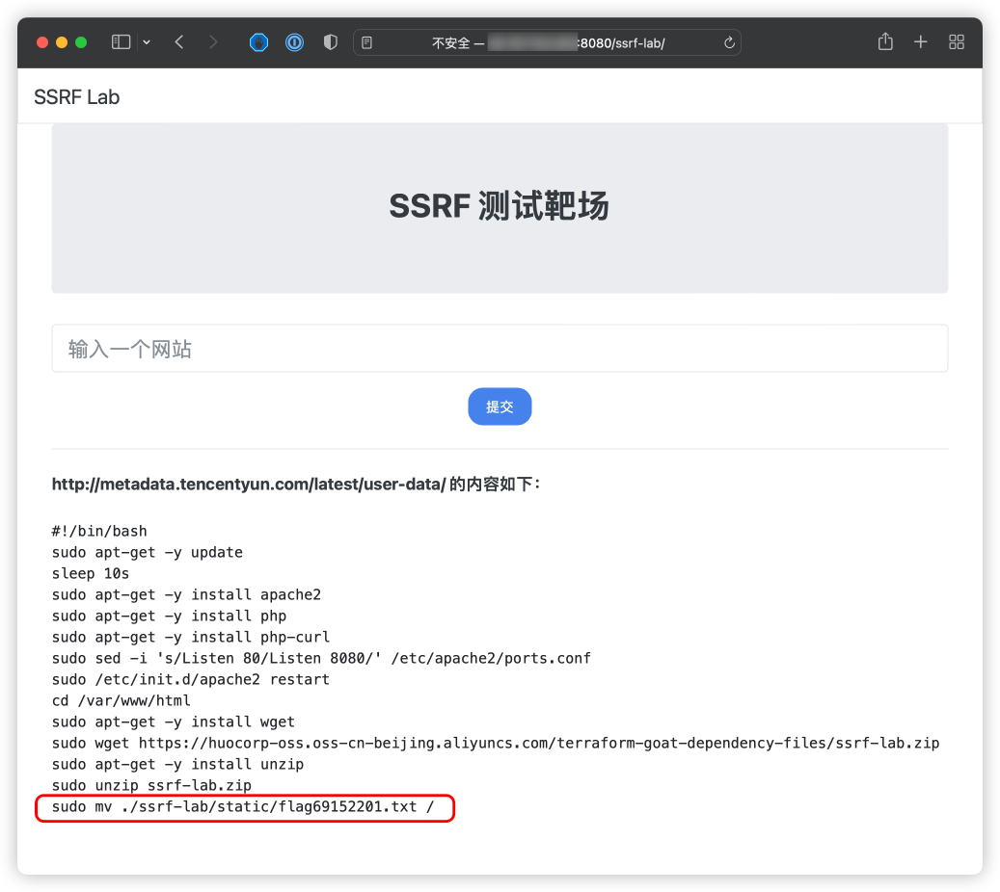
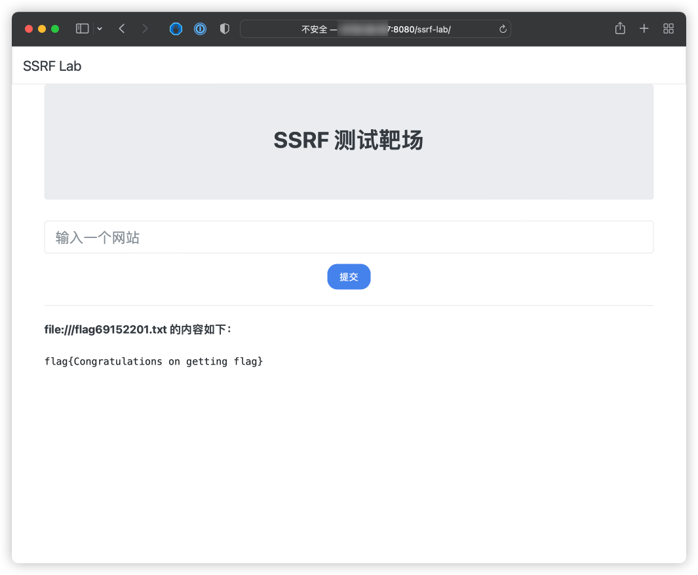

# Tencent Cloud CVM SSRF Vulnerable Environment

English | [中文](./README_CN.md)

## Description

This is a scenario used to build the Tencent Cloud CVM SSRF vulnerability environment.

After building the environment with Terraform, users can obtain metadata and user data and other information on CVM through the SSRF vulnerabilities.

## Deployment Environment

Execute the following command in the container

```shell
cd /TerraformGoat/tencentcloud/cvm/cvm_ssrf/
```

Edit the `terraform.tfvars` file and write your `tencentcloud_secret_id` and `tencentcloud_secret_key` in the file

```shell
vim terraform.tfvars
```

> You can create and view your SecretKey on the [API Key Management](https://console.cloud.tencent.com/cam/capi) of the Tencent Cloud console

Deploy Vulnerable Environment

```shell
terraform init
terraform apply
```

> When the terminal prompts `Enter a value:`, enter `yes`



After the environment is set up, You can see the access address of the scenario at Outputs, then access to the browser.

> Because the scenario takes some time to build, if your browser cannot access this site, you can wait a few minutes and access it again.

## Vulnerability Utilization

On CVM with SSRF vulnerabilities, we can use SSRF to read CVM metadata, user data and other information.

read metadata

```shell
http://metadata.tencentyun.com/latest/meta-data/
```



read user data

> The premise is that the target has been configured with user data, otherwise will be disconnected.

```shell
http://metadata.tencentyun.com/latest/user-data/
```



In the user data information, you can see that there is a flag file in the root directory of the scenario, try to use SSRF to read this file.

```shell
file:///flag69152201.txt
```



Successfully read the flag file.

## Destroy the environment

```shell
terraform destroy
```
